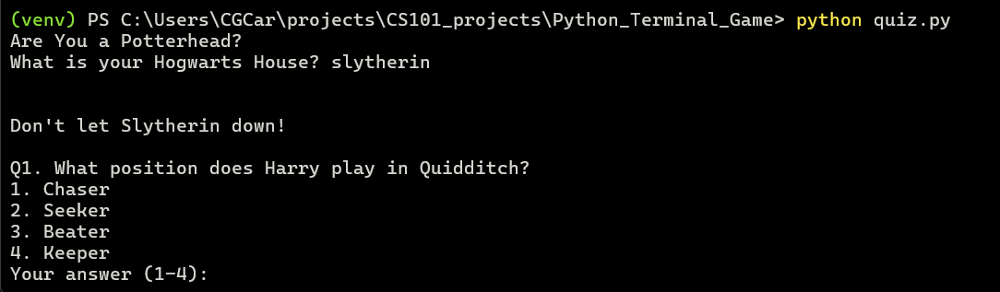

# Are You a Potterhead? - A Python CLI Quiz
A simple command-line quiz game written in Python.     
Answer multiple-choice questions about the Harry Potter universe, earn points for your Hogwarts House, and see how 
much of a true Potterhead you really are.

## Features
- 10 multiple choice Harry Potter questions
- Awards 10 points per correct answer to your chosen Hogwarts House
- Uses Python classes for clean structure
- Validates user input
- Pure CLI experience, no external libraries required.

## Demo


## Getting Started
**Requirements**
- Python 3.8 or later

**Installation**        
Clone the repository:   
*https*:        
```bash
git clone https://github.com/CharlotteGale/Python_Terminal_Game.git
cd Python_Terminal_Game
```
*ssh*:      
```bash
git clone git@github.com:CharlotteGale/Python_Terminal_Game.git
cd Python_Terminal_Game
```

Run the quiz:
```bash
python quiz.py
```

## How It Works
Each quiz question is represented as a `Question` object:
```python
class Question:
    def __init__(self, question_text, choices, answer):
        self.question_text = question_text
        self.choices = choices
        self.answer = answer
```

The program:
1. Prompts for your Hogwarts House
2. Loops through the quiz questions
3. Validates your answers (only accepts numbers in range)
4. Awards points and displays your final score

## What I Learned
- Basics of OOP in Python
- Input validation with `isdigit()`
- Structuring a small but complete project
- Using Git for version control

## Project Links
[Blog Post](https://dev.to/charlottegale/building-a-harry-potter-quiz-in-python-1m5n)       
[GitHub Repo](https://github.com/CharlotteGale/Python_Terminal_Game#)